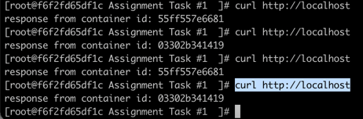

1. Run the below command to spin up the containers

    ``docker-compose up --build --scale flask=3 -d``

2. Run ``curl http://localhost`` to access the nginx, nginx will proxy the request to flask application in a round-robin fashion. Flask application is coded to return the container id 

Snapshot of response

